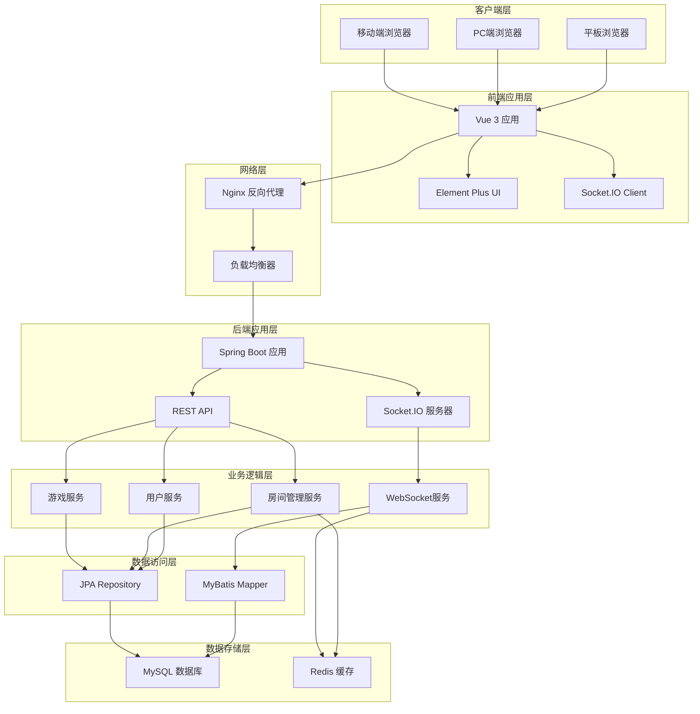

# 河南麻将线上游戏技术架构文档

## 1. 技术栈选择

### 1.1 前端技术栈
- **框架**: Vue 3.x
- **UI组件库**: Element Plus
- **状态管理**: Pinia
- **路由管理**: Vue Router
- **实时通信**: Socket.IO Client
- **HTTP客户端**: Axios
- **构建工具**: Vite
- **CSS预处理器**: SCSS
- **类型检查**: JavaScript (JSDoc)

### 1.2 后端技术栈
- **框架**: Spring Boot 3.4.5
- **数据持久层**:
  - JPA (Spring Data JPA)
  - MyBatis
- **数据库**: MySQL 8.0+
- **实时通信**: Socket.IO
- **缓存**: Redis
- **API文档**: Swagger OpenAPI 3
- **日志框架**: Logback
- **构建工具**: Maven

### 1.3 开发和部署工具
- **版本控制**: Git
- **容器化**: Docker
- **前端部署**: Nginx
- **后端部署**: Tomcat
- **数据库**: MySQL Server
- **缓存服务**: Redis Server

## 2. 系统架构

### 2.1 整体架构图



### 2.2 前端架构

#### 2.2.1 目录结构
```
frontend/
├── public/                  # 静态资源
├── src/
│   ├── api/                # API接口定义
│   ├── assets/             # 资源文件
│   │   ├── images/         # 图片资源
│   │   └── styles/         # 样式文件
│   ├── components/         # 公共组件
│   │   ├── common/         # 通用组件
│   │   ├── game/           # 游戏相关组件
│   │   └── room/           # 房间相关组件
│   ├── layouts/            # 布局组件
│   ├── pages/              # 页面组件
│   │   ├── Home.vue        # 首页
│   │   ├── GameRoom.vue    # 游戏房间
│   │   └── Spectate.vue    # 观战页面
│   ├── router/             # 路由配置
│   ├── stores/             # Pinia状态管理
│   ├── utils/              # 工具函数
│   ├── types/              # JSDoc类型定义
│   ├── App.vue             # 根组件
│   └── main.js             # 入口文件
├── package.json
├── vite.config.js
└── jsconfig.json
```

#### 2.2.2 组件架构

**核心组件**:
- `GameTable`: 游戏桌面，显示玩家手牌和牌池
- `PlayerHand`: 玩家手牌组件
- `Tile`: 麻将牌组件
- `RoomPanel`: 房间控制面板
- `GameControls`: 游戏操作控件

**状态管理**:
```javascript
// stores/game.js
export const useGameStore = defineStore('game', {
  state: () => ({
    gameState: GameState.WAITING,
    currentPlayer: 0,
    playerHand: [],
    discardPile: [],
    gameScore: {}
  }),
  actions: {
    // 游戏相关操作
  }
})
```

### 2.3 后端架构

#### 2.3.1 项目结构
```
backend/
├── src/
│   ├── main/
│   │   ├── java/
│   │   │   └── com/mahjong/
│   │   │       ├── MahjongApplication.java
│   │   │       ├── config/         # 配置类
│   │   │       ├── controller/     # 控制器层
│   │   │       │   ├── GameController.java
│   │   │       │   ├── RoomController.java
│   │   │       │   └── WebSocketController.java
│   │   │       ├── service/        # 业务逻辑层
│   │   │       │   ├── GameService.java
│   │   │       │   ├── RoomService.java
│   │   │       │   └── PlayerService.java
│   │   │       ├── repository/     # 数据访问层(JPA)
│   │   │       │   ├── GameRepository.java
│   │   │       │   └── RoomRepository.java
│   │   │       ├── mapper/         # MyBatis映射器
│   │   │       │   ├── GameMapper.java
│   │   │       │   └── RoomMapper.java
│   │   │       ├── entity/         # 实体类
│   │   │       │   ├── Game.java
│   │   │       │   ├── Room.java
│   │   │       │   └── Player.java
│   │   │       ├── dto/            # 数据传输对象
│   │   │       ├── enums/          # 枚举类
│   │   │       ├── utils/          # 工具类
│   │   │       └── websocket/      # WebSocket处理
│   │   └── resources/
│   │       ├── application.yml
│   │       ├── application-dev.yml
│   │       ├── mapper/              # MyBatis XML文件
│   │       └── static/
│   └── test/
├── pom.xml
└── Dockerfile
```

#### 2.3.2 核心服务架构

**游戏服务层**:
```java
@Service
@Transactional
public class GameService {

    @Autowired
    private GameRepository gameRepository;

    @Autowired
    private RoomService roomService;

    @Autowired
    private WebSocketService webSocketService;

    /**
     * 开始游戏
     */
    public Game startGame(String roomId) {
        // 实现游戏开始逻辑
    }

    /**
     * 处理玩家操作
     */
    public GameResult handlePlayerAction(String roomId, String playerId, PlayerAction action) {
        // 实现玩家操作逻辑
    }
}
```

## 3. 数据库设计

### 3.1 数据库架构
- **主数据库**: MySQL 8.0+
- **缓存数据库**: Redis 6.0+

### 3.2 数据库连接配置
```yaml
spring:
  datasource:
    url: jdbc:mysql://localhost:3306/mahjong_db?useUnicode=true&characterEncoding=utf8&useSSL=false
    username: ${DB_USERNAME:root}
    password: ${DB_PASSWORD:password}
    driver-class-name: com.mysql.cj.jdbc.Driver
    hikari:
      maximum-pool-size: 20
      minimum-idle: 5
      connection-timeout: 30000

  jpa:
    hibernate:
      ddl-auto: update
    show-sql: false
    properties:
      hibernate:
        dialect: org.hibernate.dialect.MySQL8Dialect

  redis:
    host: ${REDIS_HOST:localhost}
    port: ${REDIS_PORT:6379}
    timeout: 2000ms
    lettuce:
      pool:
        max-active: 8
        max-idle: 8
        min-idle: 0
```

### 3.3 JPA配置
```java
@Configuration
@EnableJpaRepositories(basePackages = "com.mahjong.repository")
@EnableTransactionManagement
public class JpaConfig {

    @Bean
    public LocalContainerEntityManagerFactoryBean entityManagerFactory(
            DataSource dataSource, JpaProperties jpaProperties) {
        // JPA实体管理器配置
    }
}
```

### 3.4 MyBatis配置
```java
@Configuration
@MapperScan(basePackages = "com.mahjong.mapper")
public class MyBatisConfig {

    @Bean
    public SqlSessionFactory sqlSessionFactory(DataSource dataSource) throws Exception {
        // MyBatis会话工厂配置
    }
}
```

## 4. 实时通信架构

### 4.1 WebSocket技术选择
- **技术**: Socket.IO
- **协议**: WebSocket + HTTP长轮询(降级方案)
- **特性**:
  - 自动重连
  - 事件驱动
  - 房间管理
  - 跨域支持

### 4.2 WebSocket事件定义

```javascript
// 客户端事件
/** @typedef {Object} ClientEvents
 * @property {function(string, Object): void} 'join-room' - 加入房间
 * @property {function(string): void} 'leave-room' - 离开房间
 * @property {function(string): void} 'player-ready' - 玩家准备
 * @property {function(string): void} 'play-tile' - 出牌
 * @property {function(Object): void} 'claim-tile' - 碰杠胡牌
 */

// 服务端事件
/** @typedef {Object} ServerEvents
 * @property {function(Object): void} 'room-updated' - 房间更新
 * @property {function(Object): void} 'game-started' - 游戏开始
 * @property {function(string): void} 'player-turn' - 玩家回合
 * @property {function(Object): void} 'tile-drawn' - 摸牌
 * @property {function(Object, string): void} 'tile-discarded' - 出牌
 * @property {function(Object): void} 'game-ended' - 游戏结束
 */
```

### 4.3 WebSocket服务实现

```java
@Component
@RequiredArgsConstructor
public class GameWebSocketHandler {

    private final SimpMessagingTemplate messagingTemplate;
    private final GameService gameService;

    @EventListener
    public void handleGameEvent(GameEvent event) {
        // 处理游戏事件并推送给客户端
        messagingTemplate.convertAndSend(
            "/topic/room/" + event.getRoomId(),
            event
        );
    }
}
```

## 5. API设计

### 5.1 REST API规范
- **协议**: HTTP/HTTPS
- **数据格式**: JSON
- **认证**: 暂不需要（按需求）
- **版本控制**: URL路径版本控制

### 5.2 API端点设计

```yaml
# 房间管理API
/api/v1/rooms:
  POST:     # 创建房间
  GET:      # 获取房间列表

/api/v1/rooms/{roomId}:
  GET:      # 获取房间详情
  PUT:      # 更新房间设置
  DELETE:   # 删除房间

/api/v1/rooms/{roomId}/join:
  POST:     # 加入房间

/api/v1/rooms/{roomId}/leave:
  POST:     # 离开房间

# 游戏管理API
/api/v1/games/{gameId}:
  GET:      # 获取游戏状态

/api/v1/games/{gameId}/start:
  POST:     # 开始游戏

/api/v1/games/{gameId}/action:
  POST:     # 执行游戏动作
```

### 5.3 响应格式标准

```json
{
  "success": true,
  "code": 200,
  "message": "操作成功",
  "data": {},
  "timestamp": "2024-01-01T00:00:00Z"
}
```

## 6. 前端优化策略

### 6.1 性能优化
- **代码分割**: 使用路由级代码分割
- **懒加载**: 组件按需加载
- **资源优化**: 图片压缩、CSS/JS压缩
- **缓存策略**: HTTP缓存、Service Worker

### 6.2 移动端适配
- **响应式设计**: 使用CSS Grid和Flexbox
- **触摸优化**: 手势识别、触摸反馈
- **性能优化**: 减少重绘重排、优化动画
- **网络适配**: 弱网环境下的用户体验

### 6.3 状态管理
```javascript
// Pinia状态管理示例
export const useRoomStore = defineStore('room', {
  state: () => ({
    currentRoom: null,
    players: [],
    isSpectating: false
  }),

  getters: {
    roomFull: (state) => state.players.length >= 4,
    canStartGame: (state) => state.players.every(p => p.isReady)
  },

  actions: {
    async joinRoom(roomId: string, playerInfo: Object) {
      try {
        const response = await api.joinRoom(roomId, playerInfo);
        this.currentRoom = response.data;
      } catch (error) {
        throw new Error('加入房间失败');
      }
    }
  }
})
```

## 7. 后端优化策略

### 7.1 性能优化
- **连接池**: 数据库连接池优化
- **缓存**: Redis缓存热点数据
- **异步处理**: 使用CompletableFuture进行异步操作
- **JVM调优**: 堆内存、垃圾回收优化

### 7.2 并发处理
```java
@Configuration
@EnableAsync
public class AsyncConfig {

    @Bean(name = "gameTaskExecutor")
    public ThreadPoolTaskExecutor gameTaskExecutor() {
        ThreadPoolTaskExecutor executor = new ThreadPoolTaskExecutor();
        executor.setCorePoolSize(10);
        executor.setMaxPoolSize(50);
        executor.setQueueCapacity(1000);
        executor.setThreadNamePrefix("Game-Async-");
        executor.initialize();
        return executor;
    }
}
```

### 7.3 数据库优化
- **索引优化**: 为常用查询字段添加索引
- **读写分离**: 主从数据库配置
- **分表分库**: 大数据量时的分库分表策略
- **连接池**: HikariCP连接池配置优化

## 8. 安全设计

### 8.1 前端安全
- **XSS防护**: 输入验证和输出转义
- **CSRF防护**: Token验证
- **内容安全策略**: CSP头部设置

### 8.2 后端安全
- **SQL注入防护**: 使用预编译语句
- **接口安全**: 请求频率限制
- **数据验证**: 严格的输入验证

```java
@RestController
@RequestMapping("/api/v1/rooms")
@Validated
public class RoomController {

    @PostMapping
    public ResponseEntity<ApiResponse<Room>> createRoom(
            @Valid @RequestBody CreateRoomRequest request) {
        // 创建房间逻辑
    }
}
```

### 8.3 WebSocket安全
- **连接验证**: 建立连接时验证身份
- **消息验证**: 验证消息格式和内容
- **频率控制**: 限制消息发送频率

## 9. 监控和运维

### 9.1 应用监控
- **性能监控**: JVM内存、CPU使用率
- **业务监控**: 游戏房间数量、在线用户数
- **错误监控**: 异常日志收集和分析

### 9.2 日志管理
```yaml
logging:
  level:
    com.mahjong: DEBUG
    org.springframework.web: INFO
  pattern:
    console: "%d{yyyy-MM-dd HH:mm:ss} [%thread] %-5level %logger{36} - %msg%n"
  file:
    name: logs/mahjong.log
    max-size: 100MB
    max-history: 30
```

### 9.3 部署架构
- **容器化部署**: Docker容器
- **负载均衡**: Nginx负载均衡
- **自动扩容**: Kubernetes集群部署（可选）

## 10. 开发规范

### 10.1 代码规范
- **Java**: 遵循Google Java Style Guide
- **JavaScript**: 遵循ESLint规则
- **Git**: 使用Conventional Commits规范

### 10.2 测试策略
- **单元测试**: JUnit 5 + Mockito
- **集成测试**: Spring Boot Test
- **前端测试**: Jest + Vue Test Utils
- **E2E测试**: Cypress（可选）

### 10.3 文档规范
- **API文档**: 使用Swagger自动生成
- **代码注释**: 关键逻辑必须有注释
- **README**: 项目说明和部署指南